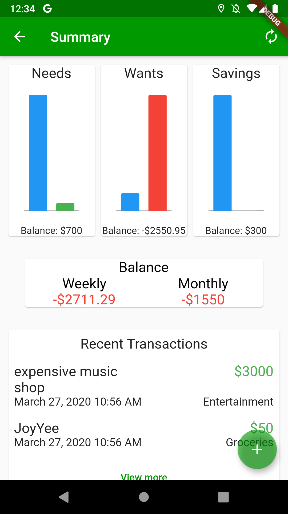
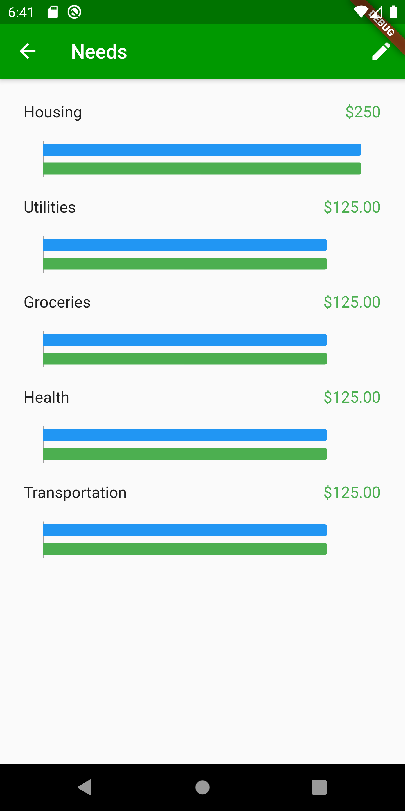
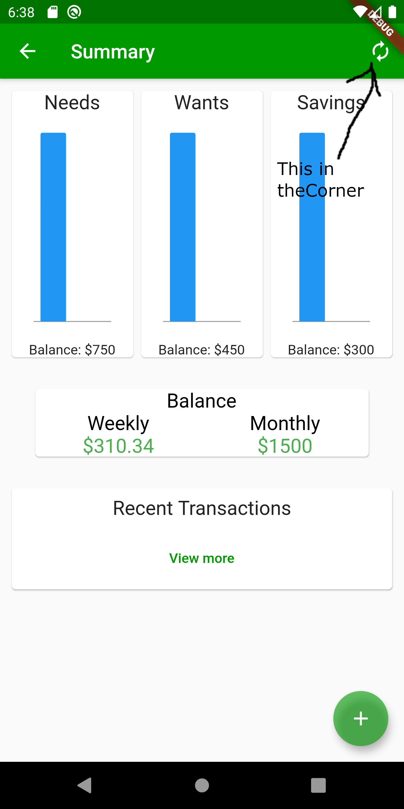

# Jawad Alif Al-Mamoon
The Personal CV of Jawad Al-Mamoon

Email: jawad298@gmail.com

Phone: 765-808-7014

Intl Phone (Bangladesh): +880 1755596697


## Personal Details
An driven international student Graduatin in July 2020 looking for an entry level job or internship for work experience. I have worked in groups consistently through out my education and have demonstrated a work ethic within my time in learning.

## Capstone Project

Application Name: Budget Flow

Description: A low barrier to entry budgeting application designed for people whom have just started or have a interest to start saving. The scope was to create a application that can deploy on both IOS and Andriod while all information remain Native. [Project and Details can be found here](https://github.com/Phlank/BudgetingMobileApp). I was mainly in charge of calculation and logic design of the application in terms of how they handle the money and budgeting allocation.

Here are a few Screenshots:




## Other Projects

Project Name: Escape the Forest
-
```
A 2D Platforming game part of a school project 
to produce a video game within the span of 4 weeks.
The game was produced by a small group of students 
as part of the final submission for the class.

The project is built in Unreal Engine 4
```
[The game can be played here](https://devoncurrent.itch.io/escape-the-forest)


Project Name: Canning Heroes
- 
```
A touch based interactive game developed within a 
multidisciplinary team under an agile development model.
We had worked for a local museum, Minnetrista
to create a touch based game to teach users the history
of canning via the exhibit the game releases with. 

This project was developed in Unreal Engine 4
```
[The game can be played here](https://doctor-g.itch.io/canning-heroes)


Project Name: Teddy Wars
-
```
A 2D platformer game developed within a small 
multi disciplinary team with the goal of 
developing complete game within a semester. 
The game was produced in a agile development 
model.

This Project was developed in Game Maker Studio 2
```
## Education

American International School Dhaka (2012-2016)

Ball State University (2016-2020), BA

Major: Computer Science

## Techncial Skills
Proficent in the following languages and frameworks:
```
-Java
  --Both Oracle and Android
-Python
-Dart 
  --Flutter
-HTML and CSS
-C
-GML
```
Proficent with the following IDE's and Engines:
```
-Intellij
-Visual Studio Code
-Unreal Engine 4
-Game Maker Studio 2
-Android Studios
```

Knowledgeable in the following fields:
```
-Mobile Application Design and Development
-Web Design and Development
-Game Design and Development
-Systems Development
```
## Work Experience
One Group, Intern (May 2019- May 2019)

-worked for two weeks at family business

-Developed understanding of inter team work flow as well as communication skills.

-Shadowed surperior employee and kept track of notes as well as helped schedule meeting.

## Hobbies
Hobbies include:
```
- Video Games
- Cooking
- Game Development
- Sport (Basketball and Soccer)
```
